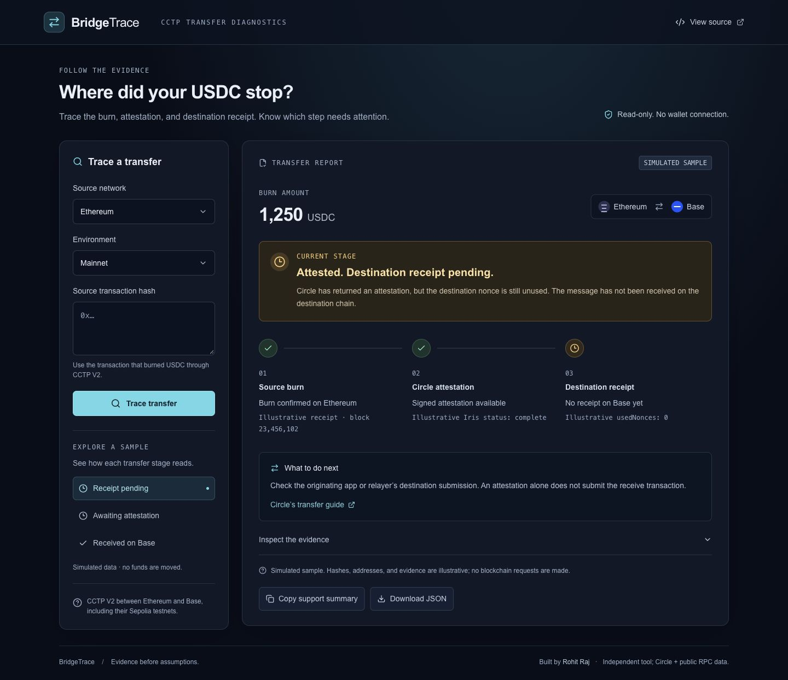

# BridgeTrace

**Where did your USDC stop?** BridgeTrace turns a CCTP V2 burn transaction into a three-stage evidence report: source burn → Circle attestation → destination receipt.

[Open the public app](https://bridgetrace-rohit.myfinancial-cfp.chatgpt.site) · [15-second product video](media/bridgetrace-15s.mp4) · [LinkedIn launch draft](launch/linkedin-post.md)



## The problem

A successful source transaction is only the first step in a cross-chain transfer. Circle’s `complete` API status means an attestation is ready; it does not prove that the destination receive transaction happened. Users and support teams need to identify the missing step without connecting a wallet or jumping between explorers.

## What v1 does

- Accepts a source transaction hash for **CCTP V2 USDC between Ethereum and Base**, on mainnet or their Sepolia testnets.
- Independently checks the source `MessageSent` log, validates the route and canonical USDC contract, and matches Circle’s decoded amount and recipient.
- Checks destination `usedNonces(bytes32)` at an observed block. When RPC is unavailable, a hinted destination transaction only counts after a matching `MessageReceived` event is verified.
- Distinguishes awaiting attestation, destination submission pending, expired attestation, confirmed receipt, reverted source, and incomplete evidence.
- Copies a support summary and exports a JSON report with provenance and evidence gaps.
- Includes three **clearly labeled simulated samples** that work without blockchain requests.

This app is read-only. It does not submit transactions, request re-attestations, recover funds, or require wallet access. It is an independent project, unaffiliated with Circle.

## Run locally

Requires Node.js 22.13+ and npm.

```sh
npm run install:ci
npm run dev
```

Open the loopback URL printed by the development server (normally port 5173).

```sh
npm test
npm run typecheck
npm run lint
npm run build
npm start
```

`npm start` previews the built Cloudflare Worker locally. The app uses React, TypeScript, Vinext/Vite, viem, and Zod. Hosting is configured for Sites through `.openai/hosting.json`; the build produces a Cloudflare Worker at `dist/server/index.js`.

No API key is required for the defaults. Optional server-only RPC overrides:

```text
BRIDGETRACE_MAINNET_ETHEREUM_RPC_URL
BRIDGETRACE_MAINNET_BASE_RPC_URL
BRIDGETRACE_TESTNET_ETHEREUM_RPC_URL
BRIDGETRACE_TESTNET_BASE_RPC_URL
```

Use your deployment provider’s environment settings for overrides. Never put RPC credentials in client-side code or Git. See [architecture and limitations](docs/architecture.md).

## API

```text
GET /api/trace?hash=0x<64 hexadecimal characters>&chain=base&environment=testnet
```

`chain` is `ethereum` or `base`; `environment` is `mainnet` or `testnet`. Successful responses contain `reports`, one per supported decoded message (maximum eight). Each report includes the source/recipient/amount, outcome, stage evidence, observation time, and gaps. Invalid input returns 400, a confirmed unsupported transaction 422, and unavailable or inconsistent provider evidence may return an `unknown` report or 502. Busy instances return 429.

## Verified live example

On October 6, 2026, a local live lookup independently confirmed this public 15-USDC Base Sepolia → Ethereum Sepolia transfer:

```text
0xfd179416c444f9cbd834af4e8b41db4e0712ae145f3a0ad729ede20b9eb0f66f
```

Select **Base Sepolia / Testnet** in the app. This is a completed historical transfer. The 20 deterministic tests use a captured public Circle response and mocked RPC receipts, including failure and expiry cases. Mainnet configuration is included; the recorded live smoke test uses testnet.

## Limits

Evidence is a point-in-time observation from third-party providers. Provider outages, rate limits, indexer lag, pruned RPC history, or missing paginated explorer logs can leave a check incomplete. RPC finality/reorgs can change observations. The app does not track continuously or guarantee delivery. Burn amount is displayed before CCTP fees; receipt confirmation does not certify the recipient’s current balance. Other bridges, CCTP V1, other chains, custom hooks, and multiple identical burns are outside the verified scope.

## References

Contracts, domains, and APIs are documented in [research and provenance](docs/research.md). The project is MIT licensed.
