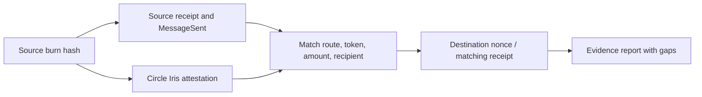

# Evidence model and operation

BridgeTrace correlates three independently identified stages of a CCTP V2 USDC transfer.

1. The server fetches the source transaction receipt over RPC, with a labeled Blockscout fallback. A successful transaction alone is insufficient: a `MessageSent` log from the configured MessageTransmitter must identify TokenMessenger V2, the source domain, destination domain, USDC contract, burn amount, and mint recipient.
2. Circle’s environment-specific Iris `/v2/messages/{sourceDomain}` endpoint returns the attestation and decoded message. The route, TokenMessenger addresses, amount, token, and recipient must match source evidence. A missing or malformed response remains unknown. Pending undecoded messages can still show the independently confirmed source burn.
3. The server reads destination `usedNonces(bytes32)` at a specific block. An exact nonzero V2 nonce is passed; the V1 source-domain/nonce hashing pattern is not used. If RPC fails, a supplied destination transaction hint is independently checked for a successful receipt with a matching MessageReceived nonce and source domain. The hint alone never proves delivery.

The deterministic outcome function is in `lib/model.ts`; transport and correlation live in `lib/trace.ts`. `app/api/trace/route.ts` validates input and returns JSON. The React dashboard presents the report used by copy/download actions. Samples use fictional hashes and fixed timestamps to keep server rendering and hydration consistent.

## Outcome precedence

Reverted source → source unknown → destination received → missing required evidence → expired attestation → awaiting attestation → attested with unused destination nonce. A historical confirmed receipt takes precedence over an expired attestation. Expiration block zero means no expiry; nonzero expiry must be strictly greater than the observed destination block to remain valid. An absent expiration block cannot establish validity.

Completion confirms successful message processing by the configured destination contract. It does not prove the recipient’s current balance, a requested gross amount after fees, or finality beyond provider observations. Signed attestations are obtained from Circle; the app checks their shape but does not locally recover and validate attester signatures.

## Provider and resource behavior

Default RPCs are PublicNode for Ethereum and the official Base endpoints. Blockscout is used for fallback transaction/log evidence. Iris hosts are `iris-api.circle.com` and `iris-api-sandbox.circle.com`; no user-supplied URL is fetched. Every request has an eight-second timeout. A bounded cache holds up to 128 reports for 30 seconds per running instance, coalesces identical lookups, and limits concurrent distinct lookups to 12 per instance. These are instance-level controls, not a global abuse-prevention system. Add provider keys and edge rate limits for sustained public traffic.

No database, wallet, account, telemetry, or durable transfer history is implemented. The app sends the entered public transaction hash to Circle and chain-data providers. The hosting platform/providers may retain their ordinary request logs. Refresh is manual. Display observation time is the lookup time; a refreshed report can be served from the 30-second cache.

## Current boundaries

Ethereum ↔ Base only, CCTP V2 only, canonical USDC, mainnet and their Sepolia testnets. Source receipts must expose the supported burn logs. Blockscout pagination is not traversed. Multiple messages are capped at eight; duplicate burns with identical route/amount/recipient are not separately correlated to source-log indices. Custom hooks and complex multi-transfer transactions require inspection in the originating app.

## Media

The 15-second MP4 uses actual dashboard screenshots with visible simulated sample labels. It is an illustrative product walkthrough, not a recording of a live transfer progressing in 15 seconds. It has silent captions and a square 1080×1080 layout for a social feed.
